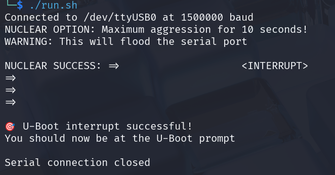
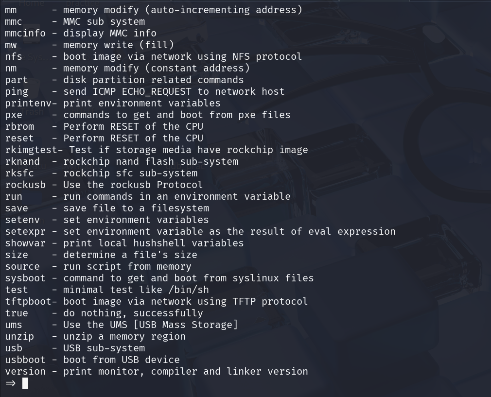

# U-boot Interupt

A Python tool to reliably interrupt U-Boot on embedded devices via serial port by sending aggressive keypress floods.

## Features

- Multiple spam modes to break into U-Boot prompt
- Configurable duration and intensity
- Cross-platform (Linux, Windows, macOS)

## Requirements

- Python 3.12
- `pyserial` library (`pip install pyserial`)

## Screenshots

`./run.sh` is nothing but `python interupt.py --port /dev/ttyUSB0 --mode nuclear --duration 10`


  
*successful interupt*



*output after getting an interupt from the script by accessing the UART using `screen /dev/ttyUSB0 1500000`*

## Usage Commands
The script may fail occasionally; try running it multiple times for best results.

```# Continuous spam until success (recommended)
python interupt.py --port /dev/ttyUSB0 --mode continuous

# Timed aggressive spam
python interupt.py --port /dev/ttyUSB0 --mode spam --duration 20

# Nuclear option (maximum flood)
python interupt.py --port /dev/ttyUSB0 --mode nuclear --duration 10


